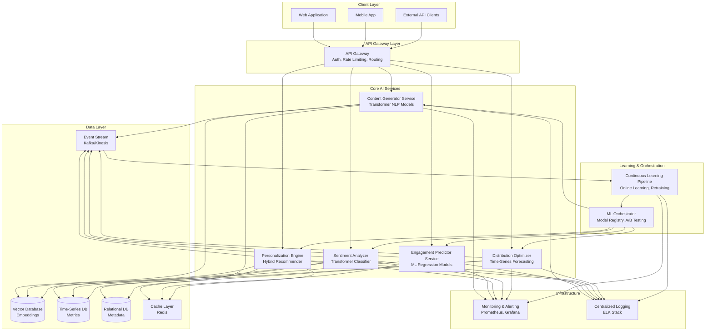
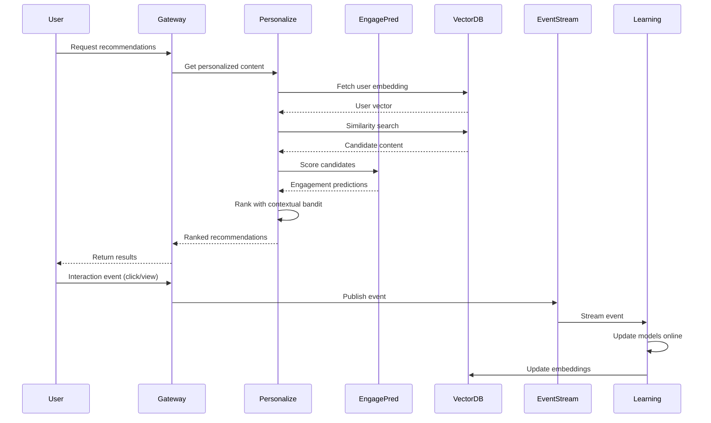

# Design Document: SmartContent AI Platform

## Overview

SmartContent AI is a microservices-based content intelligence platform that implements a closed-loop AI feedback architecture. The system consists of six core AI engines (Content Generation, Engagement Prediction, Personalization, Sentiment Analysis, Distribution Optimization, and Continuous Learning) orchestrated through a central API gateway.

The architecture follows event-driven patterns with streaming data pipelines, enabling real-time model updates and sub-2-second recommendation latency. The platform uses transformer-based models for NLP tasks, gradient boosting for engagement prediction, and hybrid recommendation algorithms combining collaborative filtering, content-based filtering, and contextual bandits.

Key design principles:
- Microservices architecture for independent scaling
- Event-driven communication for real-time responsiveness
- Model versioning and A/B testing infrastructure
- Graceful degradation with fallback mechanisms
- Horizontal scalability with stateless services

## Architecture

### System Architecture Diagram



### Component Interaction Flow



## Components and Interfaces

### 1. API Gateway

**Responsibilities:**
- Authentication and authorization (JWT validation)
- Rate limiting and throttling
- Request routing to microservices
- Response aggregation
- TLS termination

**Interfaces:**

```typescript
interface APIGateway {
  // Authentication
  authenticate(token: JWT): AuthResult
  authorize(user: User, resource: Resource, action: Action): boolean
  
  // Rate limiting
  checkRateLimit(clientId: string, endpoint: string): RateLimitResult
  
  // Routing
  route(request: HTTPRequest): Promise<HTTPResponse>
}

interface AuthResult {
  valid: boolean
  userId: string
  roles: string[]
  expiresAt: timestamp
}

interface RateLimitResult {
  allowed: boolean
  remaining: number
  resetAt: timestamp
}
```

### 2. Content Generator Service

**Responsibilities:**
- Generate content drafts using transformer models
- Optimize headlines for engagement
- Detect trending topics
- Compute semantic similarity scores

**Interfaces:**

```typescript
interface ContentGeneratorService {
  generateDraft(topic: string, context: ContentContext): Promise<GeneratedContent>
  optimizeHeadlines(headline: string, count: number): Promise<HeadlineVariation[]>
  detectTrends(timeWindow: TimeWindow): Promise<TrendingTopic[]>
  computeSimilarity(content1: Content, content2: Content): Promise<SimilarityScore>
}

interface GeneratedContent {
  text: string
  confidence: number  // 0.0 to 1.0
  metadata: ContentMetadata
  generatedAt: timestamp
}

interface HeadlineVariation {
  text: string
  predictedEngagement: number
  rank: number
}

interface TrendingTopic {
  topic: string
  momentum: number
  relatedKeywords: string[]
  timeSeriesData: DataPoint[]
}

interface SimilarityScore {
  score: number  // 0.0 to 1.0
  method: "cosine" | "jaccard" | "semantic"
}
```

### 3. Engagement Predictor Service

**Responsibilities:**
- Predict CTR, watch time, and share probability
- Classify virality potential
- Provide prediction intervals
- Fallback to historical averages on failure

**Interfaces:**

```typescript
interface EngagementPredictorService {
  predictEngagement(content: Content, context: PredictionContext): Promise<EngagementPrediction>
  classifyVirality(content: Content): Promise<ViralityClassification>
  batchPredict(contents: Content[]): Promise<EngagementPrediction[]>
}

interface EngagementPrediction {
  ctr: PredictionValue
  watchTime: PredictionValue
  shareProbability: PredictionValue
  inferenceTimeMs: number
}

interface PredictionValue {
  value: number
  confidenceInterval: {
    lower: number
    upper: number
    confidence: number  // e.g., 0.95 for 95%
  }
}

interface ViralityClassification {
  category: "low" | "medium" | "high"
  probability: number
  confidence: number
}

interface PredictionContext {
  userId?: string
  platform: string
  timestamp: timestamp
  historicalPerformance?: HistoricalMetrics
}
```

### 4. Personalization Engine

**Responsibilities:**
- Generate personalized recommendations
- Maintain user and content embeddings
- Implement hybrid filtering (collaborative + content-based + contextual bandit)
- Real-time embedding updates

**Interfaces:**

```typescript
interface PersonalizationEngine {
  getRecommendations(userId: string, context: RecommendationContext): Promise<RankedContent[]>
  getUserEmbedding(userId: string): Promise<UserEmbedding>
  updateUserEmbedding(userId: string, interaction: Interaction): Promise<void>
  coldStartRecommendations(userProfile: UserProfile): Promise<RankedContent[]>
}

interface RankedContent {
  contentId: string
  score: number
  rank: number
  explanation: RecommendationExplanation
}

interface RecommendationContext {
  platform: string
  deviceType: string
  timeOfDay: number
  recentInteractions: Interaction[]
  count: number
}

interface UserEmbedding {
  vector: number[]  // Dense embedding vector
  lastUpdated: timestamp
  confidence: number
}

interface RecommendationExplanation {
  method: "collaborative" | "content_based" | "contextual_bandit" | "hybrid"
  factors: string[]
}
```

### 5. Sentiment Analyzer Service

**Responsibilities:**
- Classify sentiment (positive/negative/neutral)
- Detect emotions (joy, anger, sadness, surprise, fear)
- Cluster similar comments
- Compute aggregate sentiment trends

**Interfaces:**

```typescript
interface SentimentAnalyzerService {
  analyzeSentiment(text: string): Promise<SentimentResult>
  detectEmotions(text: string): Promise<EmotionResult>
  clusterComments(comments: Comment[]): Promise<CommentCluster[]>
  computeTrends(timeWindow: TimeWindow): Promise<SentimentTrend[]>
  getEmotionWeights(emotions: EmotionResult): Promise<RankingWeights>
}

interface SentimentResult {
  sentiment: "positive" | "negative" | "neutral"
  confidence: number  // Must be >= 0.8
  score: number  // -1.0 to 1.0
}

interface EmotionResult {
  primary: Emotion
  secondary?: Emotion
  scores: {
    joy: number
    anger: number
    sadness: number
    surprise: number
    fear: number
  }
}

interface Emotion {
  type: "joy" | "anger" | "sadness" | "surprise" | "fear"
  intensity: number  // 0.0 to 1.0
}

interface CommentCluster {
  clusterId: string
  comments: Comment[]
  centroid: number[]
  averageSentiment: SentimentResult
}

interface SentimentTrend {
  timestamp: timestamp
  aggregateScore: number
  volume: number
}

interface RankingWeights {
  emotionMultipliers: Map<string, number>
}
```

### 6. Distribution Optimizer Service

**Responsibilities:**
- Forecast optimal posting times
- Generate platform-specific formatting
- Orchestrate A/B tests
- Prioritize distribution channels

**Interfaces:**

```typescript
interface DistributionOptimizerService {
  forecastOptimalTime(content: Content, platforms: Platform[]): Promise<TimeRecommendation[]>
  generatePlatformFormat(content: Content, platform: Platform): Promise<FormattedContent>
  orchestrateABTest(variants: ContentVariant[]): Promise<ABTestConfig>
  prioritizeChannels(content: Content, channels: Channel[]): Promise<ChannelPriority[]>
}

interface TimeRecommendation {
  platform: Platform
  optimalTime: timestamp
  confidenceInterval: {
    start: timestamp
    end: timestamp
  }
  alternativeTimes: timestamp[]
  predictedEngagement: number
}

interface FormattedContent {
  platform: Platform
  text: string
  characterCount: number
  hashtags: string[]
  mediaFormat: MediaFormat
  metadata: PlatformMetadata
}

interface ABTestConfig {
  testId: string
  variants: TestVariant[]
  trafficSplit: number[]
  duration: number
  successMetric: string
  significanceThreshold: number
}

interface ChannelPriority {
  channel: Channel
  priority: number
  predictedROI: number
  reasoning: string
}
```

### 7. Continuous Learning Pipeline

**Responsibilities:**
- Online learning from engagement streams
- Drift detection and alerting
- Periodic model retraining
- Feedback-based weight recalibration

**Interfaces:**

```typescript
interface ContinuousLearningPipeline {
  processEngagementEvent(event: EngagementEvent): Promise<void>
  detectDrift(modelId: string): Promise<DriftReport>
  scheduleRetraining(modelId: string, config: RetrainingConfig): Promise<TrainingJob>
  recalibrateWeights(modelId: string, feedback: Feedback[]): Promise<void>
  deployModel(modelId: string, version: string, strategy: DeploymentStrategy): Promise<void>
}

interface EngagementEvent {
  eventId: string
  userId: string
  contentId: string
  eventType: "view" | "click" | "share" | "comment" | "like"
  timestamp: timestamp
  metadata: EventMetadata
}

interface DriftReport {
  modelId: string
  currentAccuracy: number
  baselineAccuracy: number
  driftDetected: boolean
  driftMagnitude: number
  recommendation: "monitor" | "retrain" | "rollback"
}

interface RetrainingConfig {
  dataWindow: TimeWindow
  hyperparameters: Map<string, any>
  validationSplit: number
  earlyStoppingPatience: number
}

interface DeploymentStrategy {
  type: "canary" | "blue_green" | "rolling"
  canaryPercentage?: number
  rolloutDuration?: number
  rollbackThreshold?: number
}
```

## Data Models

### User Model

```typescript
interface User {
  userId: string
  email: string
  roles: Role[]
  createdAt: timestamp
  lastActive: timestamp
  preferences: UserPreferences
  embedding: UserEmbedding
}

interface UserPreferences {
  topics: string[]
  contentTypes: ContentType[]
  platforms: Platform[]
  notificationSettings: NotificationSettings
}

interface Role {
  roleId: string
  name: string
  permissions: Permission[]
}
```

### Content Model

```typescript
interface Content {
  contentId: string
  title: string
  body: string
  authorId: string
  createdAt: timestamp
  updatedAt: timestamp
  status: "draft" | "published" | "archived"
  embedding: ContentEmbedding
  metadata: ContentMetadata
  engagementMetrics: EngagementMetrics
}

interface ContentEmbedding {
  vector: number[]
  model: string
  version: string
  generatedAt: timestamp
}

interface ContentMetadata {
  topics: string[]
  keywords: string[]
  language: string
  readingTime: number
  mediaType: MediaType
}

interface EngagementMetrics {
  views: number
  clicks: number
  shares: number
  comments: number
  likes: number
  averageWatchTime: number
  ctr: number
}
```

### Interaction Model

```typescript
interface Interaction {
  interactionId: string
  userId: string
  contentId: string
  type: InteractionType
  timestamp: timestamp
  duration?: number
  platform: Platform
  deviceType: string
  context: InteractionContext
}

type InteractionType = "view" | "click" | "share" | "comment" | "like" | "bookmark" | "skip"

interface InteractionContext {
  referrer?: string
  position: number
  sessionId: string
  abTestVariant?: string
}
```

### Model Registry

```typescript
interface MLModel {
  modelId: string
  name: string
  version: string
  type: ModelType
  framework: "pytorch" | "tensorflow" | "sklearn" | "xgboost"
  status: "training" | "validating" | "deployed" | "deprecated"
  metrics: ModelMetrics
  artifacts: ModelArtifacts
  deployedAt?: timestamp
}

type ModelType = "content_generation" | "engagement_prediction" | "recommendation" | "sentiment_analysis" | "time_series_forecast"

interface ModelMetrics {
  accuracy?: number
  precision?: number
  recall?: number
  f1Score?: number
  ndcg?: number
  rmse?: number
  mae?: number
  customMetrics: Map<string, number>
}

interface ModelArtifacts {
  modelPath: string
  configPath: string
  checkpointPath?: string
  vocabularyPath?: string
}
```


## Correctness Properties

*A property is a characteristic or behavior that should hold true across all valid executions of a system—essentially, a formal statement about what the system should do. Properties serve as the bridge between human-readable specifications and machine-verifiable correctness guarantees.*

### Property Reflection

After analyzing all 60 acceptance criteria, I identified the following redundancies and consolidations:

**Consolidated Properties:**
- Latency properties (7.1, 7.2, 1.1, 2.1, 3.1) can be tested with a single latency measurement property across different endpoints
- Confidence interval properties (2.5, 5.5) share the same structure validation pattern
- Embedding update properties (3.3, 6.1, 6.4) all test state changes after events
- Validation properties (10.5, 9.2) both test input rejection for invalid data
- Monitoring properties (11.1, 11.2, 11.5) all test that expected data is emitted

**Eliminated Redundancies:**
- Property 3.4 (RL policy application) is an implementation detail, not externally testable
- Property 8.1 (99% uptime) is a production metric, not suitable for property testing
- Properties that test the same invariant with different data types are consolidated

The following properties represent unique, non-redundant correctness guarantees:

### Content Generation Properties

**Property 1: Content generation completeness**
*For any* valid topic input, the Content_Generator should return generated content that includes text, confidence score, metadata, and timestamp fields.
**Validates: Requirements 1.1, 1.5**

**Property 2: Headline variation count and ranking**
*For any* headline input, the Content_Generator should return exactly 5 variations, each with unique text and monotonically decreasing predicted engagement scores (rank 1 has highest score).
**Validates: Requirements 1.2**

**Property 3: Similarity score bounds**
*For any* two content items, the computed similarity score should be in the range [0.0, 1.0] inclusive.
**Validates: Requirements 1.3**

**Property 4: Trend detection time window**
*For any* trend analysis request, the detected trends should only include data points from the past 30 days (no older data).
**Validates: Requirements 1.4**

### Engagement Prediction Properties

**Property 5: Prediction completeness and structure**
*For any* content submitted for prediction, the response should include CTR, watch time, and share probability values, each with confidence intervals containing lower, upper, and confidence level fields.
**Validates: Requirements 2.1, 2.3, 2.5**

**Property 6: Virality classification validity**
*For any* content virality classification, the category should be one of {"low", "medium", "high"} and include a confidence score in range [0.0, 1.0].
**Validates: Requirements 2.2**

**Property 7: Prediction fallback on failure**
*For any* prediction request when the model is unavailable, the system should return fallback predictions based on historical averages rather than failing.
**Validates: Requirements 2.4**

### Personalization Properties

**Property 8: Recommendation response time**
*For any* user recommendation request, the system should return ranked results within 2000ms.
**Validates: Requirements 3.1**

**Property 9: Cold start embedding generation**
*For any* new user with demographic data, the Personalization_Engine should generate a User_Embedding with a non-zero vector.
**Validates: Requirements 3.2**

**Property 10: Embedding updates after interaction**
*For any* user interaction event, the User_Embedding vector should differ from its pre-interaction state (embeddings are updated, not static).
**Validates: Requirements 3.3**

**Property 11: Recommendation quality threshold**
*For any* validation dataset with ground truth relevance, the recommendation system should achieve NDCG score ≥ 0.7.
**Validates: Requirements 3.5**

### Sentiment Analysis Properties

**Property 12: Sentiment classification validity and confidence**
*For any* text input, the sentiment classification should return one of {"positive", "negative", "neutral"} with confidence ≥ 0.8.
**Validates: Requirements 4.1**

**Property 13: Emotion detection validity**
*For any* text input, the detected primary emotion should be one of {"joy", "anger", "sadness", "surprise", "fear"} with intensity in range [0.0, 1.0].
**Validates: Requirements 4.2**

**Property 14: Comment clustering coherence**
*For any* set of clustered comments, comments within the same cluster should have higher average cosine similarity than comments from different clusters.
**Validates: Requirements 4.3**

**Property 15: Sentiment trend time window**
*For any* sentiment trend analysis with a configured time window, all included data points should fall within that window.
**Validates: Requirements 4.4**

**Property 16: Emotion-based ranking weights**
*For any* emotion result, the generated ranking weights should produce different multipliers for different emotion types.
**Validates: Requirements 4.5**

### Distribution Optimization Properties

**Property 17: Platform formatting compliance**
*For any* content formatted for a specific platform, the output should respect platform constraints (e.g., Twitter ≤ 280 characters, Instagram hashtag limits).
**Validates: Requirements 5.2**

**Property 18: A/B test configuration completeness**
*For any* A/B test orchestration, the configuration should include test ID, variants, traffic split percentages that sum to 1.0, and significance threshold.
**Validates: Requirements 5.3**

**Property 19: Channel prioritization by ROI**
*For any* set of distribution channels, channels with higher predicted ROI should have higher priority scores.
**Validates: Requirements 5.4**

**Property 20: Time prediction structure**
*For any* optimal time forecast, the result should include optimal time, confidence interval (start/end), and at least one alternative time.
**Validates: Requirements 5.1, 5.5**

### Continuous Learning Properties

**Property 21: Model updates from events**
*For any* engagement event processed by the Learning_Pipeline, the model state or weights should change (models are updated, not static).
**Validates: Requirements 6.1, 6.4**

**Property 22: Drift detection threshold**
*For any* model with accuracy below 90% of baseline, the Drift_Detector should report drift as detected and recommend action.
**Validates: Requirements 6.2**

**Property 23: Retraining data window**
*For any* scheduled retraining job, the training dataset should only include data from the past 90 days.
**Validates: Requirements 6.3**

**Property 24: Model deployment A/B testing**
*For any* model deployment, an A/B test configuration should be created comparing the new version against the current version.
**Validates: Requirements 6.5**

### Performance and Scalability Properties

**Property 25: API latency percentiles**
*For any* sample of 1000 API requests, the 95th percentile latency should be ≤ 2000ms and 99th percentile model inference latency should be ≤ 500ms.
**Validates: Requirements 7.1, 7.2**

**Property 26: Concurrent user capacity**
*For any* load test with 10,000 concurrent users, the system should maintain response times within SLO thresholds (p95 < 2000ms).
**Validates: Requirements 7.3**

**Property 27: Auto-scaling triggers**
*For any* simulated load that pushes CPU utilization ≥ 70% or request queue depth ≥ 100, the system should trigger horizontal scaling within 60 seconds.
**Validates: Requirements 7.4**

**Property 28: Rate limiting and backoff**
*For any* client exceeding rate limits, subsequent requests should be throttled with exponentially increasing delays (backoff).
**Validates: Requirements 7.5**

### Reliability Properties

**Property 29: Circuit breaker state transitions**
*For any* downstream service that fails repeatedly, the circuit breaker should transition to "open" state and attempt recovery after a timeout period.
**Validates: Requirements 8.3**

**Property 30: Error logging with correlation**
*For any* error that occurs, the system should emit a structured log entry containing a correlation ID for distributed tracing.
**Validates: Requirements 8.4, 11.2**

**Property 31: Health monitoring metrics**
*For any* system operation period, metrics for latency, throughput, error rates, and model performance should be emitted to monitoring infrastructure.
**Validates: Requirements 8.5, 11.1**

### Security Properties

**Property 32: JWT validation correctness**
*For any* JWT token, the system should accept tokens with valid RS256 signatures and expiration < 1 hour, and reject tokens with invalid signatures, expired timestamps, or missing claims.
**Validates: Requirements 9.2**

**Property 33: Role-based access control**
*For any* user attempting to access a resource, access should be granted only if the user's roles include the required permission for that resource and action.
**Validates: Requirements 9.3**

**Property 34: Data deletion compliance**
*For any* user data deletion request, all personal data associated with that user should be removed from all storage systems within the specified timeframe.
**Validates: Requirements 9.4**

### Data Pipeline Properties

**Property 35: Exactly-once event processing**
*For any* engagement event sent multiple times (duplicates), the system should process and record the effect exactly once (idempotent processing).
**Validates: Requirements 10.1**

**Property 36: Embedding storage and retrieval**
*For any* user or content embedding stored in the vector database, similarity search queries should successfully retrieve the embedding.
**Validates: Requirements 10.2**

**Property 37: Query performance scaling**
*For any* training dataset query up to 1TB, the retrieval time should be ≤ 10 seconds.
**Validates: Requirements 10.3**

**Property 38: Data archival by age**
*For any* data older than 2 years, the system should automatically move it to cold storage (not in hot storage).
**Validates: Requirements 10.4**

**Property 39: Schema validation and rejection**
*For any* incoming data that violates the defined schema, the system should reject the record and not persist invalid data.
**Validates: Requirements 10.5**

### Monitoring Properties

**Property 40: Prediction anomaly detection**
*For any* batch of predictions with distribution significantly different from baseline (e.g., >3 standard deviations), the system should trigger an anomaly alert.
**Validates: Requirements 11.3**

**Property 41: SLO violation alerting**
*For any* measurement period where p95 latency > 2000ms or error rate > 1%, the system should emit an SLO violation alert.
**Validates: Requirements 11.4**

**Property 42: Dashboard refresh interval**
*For any* dashboard displaying real-time metrics, the displayed values should update within 5 seconds of the underlying metric change.
**Validates: Requirements 11.5**

### Integration Properties

**Property 43: Exponential backoff retry**
*For any* third-party API call that returns a rate limit error, subsequent retry attempts should use exponentially increasing delays (e.g., 1s, 2s, 4s, 8s).
**Validates: Requirements 12.2**

**Property 44: Model versioning support**
*For any* deployed ML model, the system should track and store version metadata, allowing multiple versions to coexist.
**Validates: Requirements 12.3**

**Property 45: Webhook at-least-once delivery**
*For any* webhook event, the system should attempt delivery until successful, ensuring the event is delivered at least once even if initial attempts fail.
**Validates: Requirements 12.4**

**Property 46: Hot-loading plugins**
*For any* plugin module added to the system, the plugin should load and become available without requiring a system restart or redeployment.
**Validates: Requirements 12.5**

## Error Handling

### Error Categories

The system implements a hierarchical error handling strategy with the following categories:

1. **Client Errors (4xx)**
   - Invalid input data (400 Bad Request)
   - Authentication failures (401 Unauthorized)
   - Authorization failures (403 Forbidden)
   - Resource not found (404 Not Found)
   - Rate limit exceeded (429 Too Many Requests)

2. **Server Errors (5xx)**
   - Model inference failures (500 Internal Server Error)
   - Service unavailable (503 Service Unavailable)
   - Gateway timeout (504 Gateway Timeout)

3. **ML-Specific Errors**
   - Model not loaded
   - Prediction timeout
   - Invalid feature dimensions
   - Drift detected
   - Training failure

### Error Handling Strategies

**Graceful Degradation:**
- When ML models fail, fall back to rule-based heuristics or cached predictions
- When personalization fails, return popular content
- When sentiment analysis fails, skip emotion-based ranking adjustments

**Circuit Breakers:**
- Implement circuit breakers for all downstream service calls
- States: Closed (normal), Open (failing), Half-Open (testing recovery)
- Automatic recovery attempts after timeout periods

**Retry Logic:**
- Exponential backoff for transient failures
- Maximum retry attempts: 3
- Jitter to prevent thundering herd

**Error Propagation:**
- Structured error responses with error codes, messages, and correlation IDs
- Preserve error context through distributed tracing
- Log all errors with appropriate severity levels

**Validation:**
- Input validation at API gateway
- Schema validation for all data ingestion
- Model output validation (check for NaN, infinity, out-of-range values)

### Error Response Format

```typescript
interface ErrorResponse {
  error: {
    code: string
    message: string
    details?: any
    correlationId: string
    timestamp: timestamp
    retryable: boolean
  }
}
```

## Testing Strategy

### Dual Testing Approach

The SmartContent AI platform requires both unit testing and property-based testing for comprehensive coverage:

**Unit Tests** focus on:
- Specific examples demonstrating correct behavior
- Edge cases (empty inputs, boundary values, null handling)
- Error conditions and exception handling
- Integration points between components
- Mock-based testing of external dependencies

**Property-Based Tests** focus on:
- Universal properties that hold for all inputs
- Invariants that must be maintained
- Round-trip properties (serialization/deserialization)
- Metamorphic properties (relationships between inputs/outputs)
- Performance properties (latency bounds, throughput)

Together, these approaches provide comprehensive coverage: unit tests catch concrete bugs and validate specific scenarios, while property tests verify general correctness across the input space.

### Property-Based Testing Configuration

**Framework Selection:**
- Python: Use `hypothesis` library
- TypeScript/JavaScript: Use `fast-check` library
- Java: Use `jqwik` library

**Test Configuration:**
- Minimum 100 iterations per property test (due to randomization)
- Configurable seed for reproducibility
- Shrinking enabled to find minimal failing examples
- Timeout: 30 seconds per property test

**Property Test Tagging:**
Each property-based test must include a comment tag referencing the design document property:

```python
# Feature: smartcontent-ai-platform, Property 1: Content generation completeness
@given(st.text(min_size=1))
def test_content_generation_completeness(topic):
    result = content_generator.generate_draft(topic)
    assert result.text is not None
    assert 0.0 <= result.confidence <= 1.0
    assert result.metadata is not None
    assert result.generatedAt is not None
```

### Testing Pyramid

```
         /\
        /  \  E2E Tests (10%)
       /____\  - Critical user journeys
      /      \  - Full system integration
     /________\ Integration Tests (20%)
    /          \ - Service interactions
   /____________\ - API contract testing
  /              \ Unit + Property Tests (70%)
 /________________\ - Component logic
                    - Property verification
```

### ML Model Testing

**Model Validation:**
- Offline evaluation on held-out test sets
- A/B testing in production before full rollout
- Shadow mode deployment for new models
- Continuous monitoring of prediction distributions

**Property Tests for ML:**
- Prediction output ranges (probabilities in [0,1])
- Prediction consistency (same input → same output for deterministic models)
- Embedding dimensionality consistency
- Model inference latency bounds

**Data Quality Tests:**
- Schema validation for training data
- Distribution shift detection
- Label quality checks
- Feature correlation analysis

### Performance Testing

**Load Testing:**
- Simulate 10,000+ concurrent users
- Measure p50, p95, p99 latency percentiles
- Verify auto-scaling triggers
- Test rate limiting and throttling

**Stress Testing:**
- Push system beyond normal capacity
- Identify breaking points
- Verify graceful degradation
- Test recovery after overload

**Endurance Testing:**
- Run system under normal load for extended periods (24+ hours)
- Detect memory leaks
- Verify log rotation and cleanup
- Monitor resource utilization trends

### Security Testing

**Authentication/Authorization:**
- Test JWT validation with expired, invalid, and malformed tokens
- Verify RBAC enforcement for all protected endpoints
- Test session management and token refresh

**Input Validation:**
- Fuzz testing with malformed inputs
- SQL injection attempts (if applicable)
- XSS prevention validation
- Command injection prevention

**Encryption:**
- Verify TLS 1.3 enforcement
- Test data-at-rest encryption
- Validate key rotation procedures

### Integration Testing

**Service Integration:**
- Test API contracts between microservices
- Verify event streaming pipelines
- Test database interactions
- Validate external API integrations

**Failure Scenarios:**
- Simulate downstream service failures
- Test circuit breaker behavior
- Verify fallback mechanisms
- Test retry logic and backoff

### Continuous Testing

**CI/CD Pipeline:**
- Run unit and property tests on every commit
- Run integration tests on pull requests
- Run performance tests on staging before production
- Automated rollback on test failures

**Production Monitoring:**
- Synthetic transactions for health checks
- Real user monitoring (RUM)
- Error rate tracking
- SLO compliance monitoring
